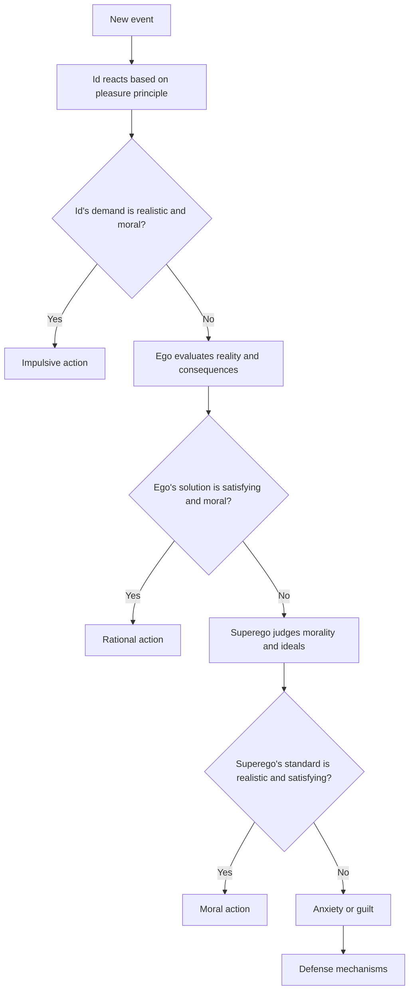

# PsycheAI
Psyche architecture based AI that aims to integrate ML models with human like behavior architecture with the goal of creating a complex rationing and reactionary system.

According to Freudian psychology, the human psyche is composed of three elements: the id, the ego, and the superego. The id is the primitive and instinctive part of the mind that contains sexual and aggressive drives and hidden memories. The id operates on the pleasure principle, which is the idea that every wishful impulse should be satisfied immediately, regardless of the consequences. The ego is the rational and conscious part of the mind that mediates between the id’s demands and the realities of the external world. The ego operates on the reality principle, which is the idea that some impulses need to be delayed or modified to avoid negative outcomes. The superego is the moral and idealistic part of the mind that represents the internalized values and norms of society. The superego operates on the morality principle, which is the idea that some impulses are wrong and should be suppressed or punished.

Freud believed that these three elements of personality interact in ways that have a powerful influence on human behavior. He also believed that biological imperatives, such as survival, reproduction, and aggression, are important sources of motivation for human actions. These imperatives are mainly expressed through the id, which seeks to satisfy them without regard for morality or reality. However, the ego and the superego also play a role in regulating these impulses and finding acceptable ways to fulfill them.

As a product of ego, id and biological imperatives, human behavior can be seen as a result of a dynamic balance between these different forces. Sometimes, the id may dominate and lead to impulsive or irrational actions. Sometimes, the superego may dominate and lead to guilt or anxiety. Sometimes, the ego may dominate and lead to rational or adaptive actions. Freud suggested that a healthy personality is one that maintains a harmonious balance between these three elements

# Response behaviour architecture

# Steps
- Define the id, ego and superego as separate modules or agents that can communicate with each other and have access to a common memory and perception system.
- Implement the pleasure principle, the reality principle and the morality principle as different optimization criteria or reward functions for each module or agent.
- Train the id module or agent to generate impulses or actions based on the pleasure principle, using reinforcement learning or evolutionary algorithms.
- Train the ego module or agent to evaluate the feasibility and consequences of the id’s impulses or actions based on the reality principle, using logic, planning or causal inference.
- Train the superego module or agent to judge the morality and ideals of the id’s impulses or actions based on the morality principle, using symbolic reasoning, ethical frameworks or social norms.
- Implement a decision-making mechanism that can balance the inputs from the id, ego and superego modules or agents and select an output action that maximizes the overall satisfaction and minimizes the overall conflict.
- Implement a feedback mechanism that can update the memory and perception system based on the outcome of the output action and adjust the parameters of each module or agent accordingly.

# Issues to solve
- How to define and measure pleasure, reality and morality in a consistent and objective way?
- How to deal with uncertainty, ambiguity and inconsistency in the input data and the output action?
- How to ensure that the AI is aligned with human values and goals and does not harm itself or others?
- How to evaluate and explain the AI’s behavior and reasoning process?
- How to handle ethical dilemmas and moral conflicts that may arise from different situations?
